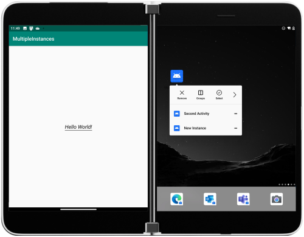
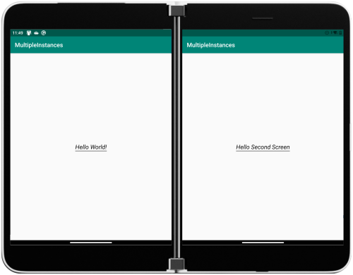

# Multiple instances sample for Surface Duo

Android allows your app to start another instance - Microsoft Edge on the Surface Duo can be opened twice to have two different browsing sessions. To test with the sample, long-tap to show the shortcut menu:



Two instances can run side-by-side:



This code sets the correct intent flags in the shortcut menu to enable the behavior:

```java
val intent = Intent(
    Intent.ACTION_MAIN, Uri.EMPTY,
    this,
    MainActivity::class.java
)
intent.addFlags(Intent.FLAG_ACTIVITY_MULTIPLE_TASK or Intent.FLAG_ACTIVITY_SINGLE_TOP)

val intent2 = Intent(
    Intent.ACTION_MAIN,
    Uri.EMPTY,
    this,
    SecondActivity::class.java
)
intent.addFlags(Intent.FLAG_ACTIVITY_MULTIPLE_TASK or Intent.FLAG_ACTIVITY_SINGLE_TOP)

val shortcutManager = getSystemService<ShortcutManager>(ShortcutManager::class.java)
val shortcut = ShortcutInfo.Builder(this, "id1")
        .setShortLabel(getString(R.string.main_shortcut_label))
        .setLongLabel(getString(R.string.main_shortcut_label))
        .setIntent(intent)
        .build()
val shortcut2 = ShortcutInfo.Builder(this, "id2")
        .setShortLabel(getString(R.string.second_shortcut_label))
        .setLongLabel(getString(R.string.second_shortcut_label))
        .setIntent(intent2)
        .build()

if (shortcutManager != null) {
    shortcutManager.dynamicShortcuts = listOf(shortcut, shortcut2)
}
```

## Related links

- [Introduction to dual-screen devices](https://docs.microsoft.com/dual-screen/introduction)
- [Get the Surface Duo emulator](https://docs.microsoft.com/dual-screen/android/emulator/)

This sample is also available in [Java](https://github.com/microsoft/surface-duo-sdk-samples/tree/master/MultipleInstances).
