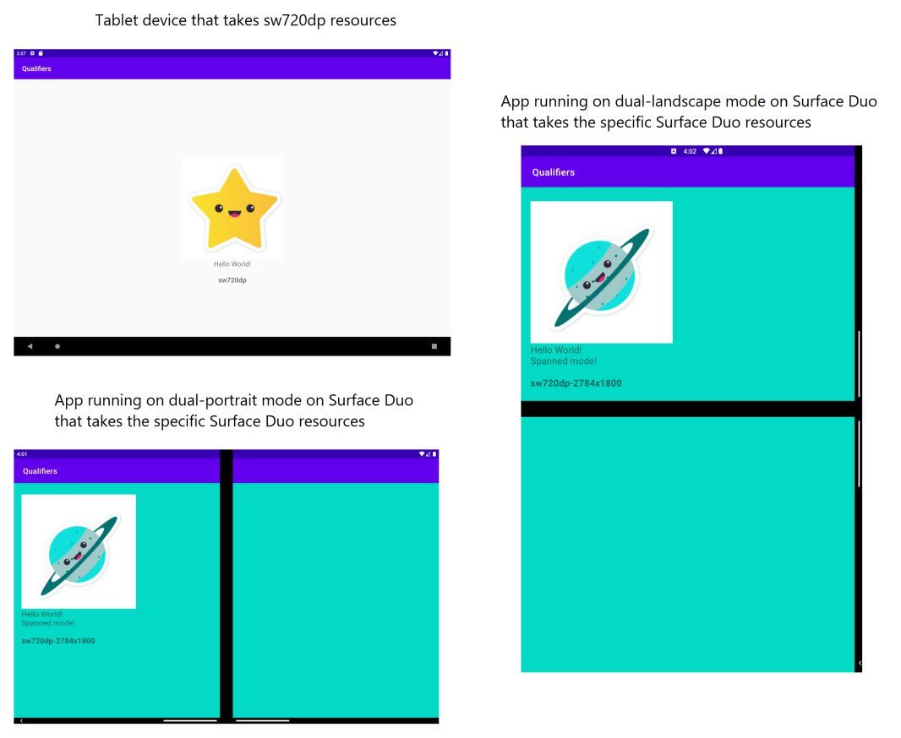

# Resource qualifiers for Surface Duo

This sample contains code that [accompanies this blog post](https://devblogs.microsoft.com/surface-duo/resource-configuration-for-microsoft-surface-duo/), and demonstrates how to load layouts or values XML specifically for the Surface Duo using resource qualifier folder names.

The resources directory contains the following subdirectories:

- drawable
- drawable-sw720dp-2784x1800
- layout
- layout-sw720dp
- layout-sw720dp-2784x1800
- values
- values-sw540dp-1350x1800
- values-sw720dp
- values-sw720dp-2784x1800

The "qualified" directories provide resources when the criteria are matched. "sw" stands for "smallest width".

## Related links

- [Surface Duo resource qualifier docs](https://docs.microsoft.com/dual-screen/android/platform/resource-qualifier/)
- [Resource configuration blog post](https://devblogs.microsoft.com/surface-duo/resource-configuration-for-microsoft-surface-duo/)
- [Get the Surface Duo emulator](https://docs.microsoft.com/dual-screen/android/emulator/)
