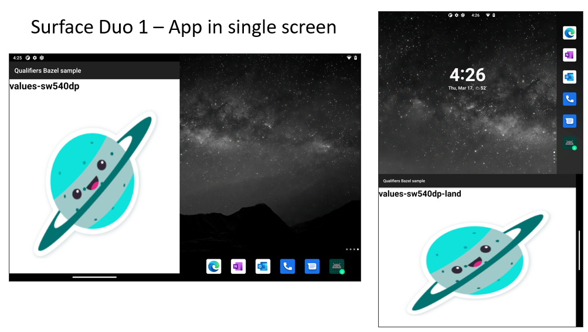
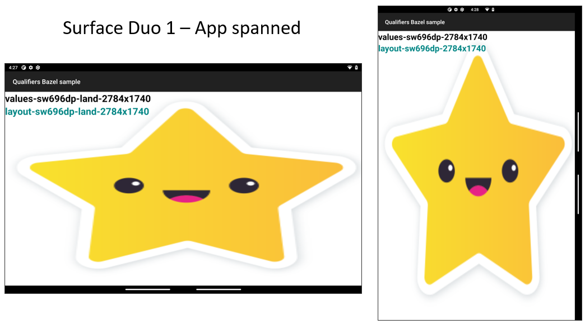
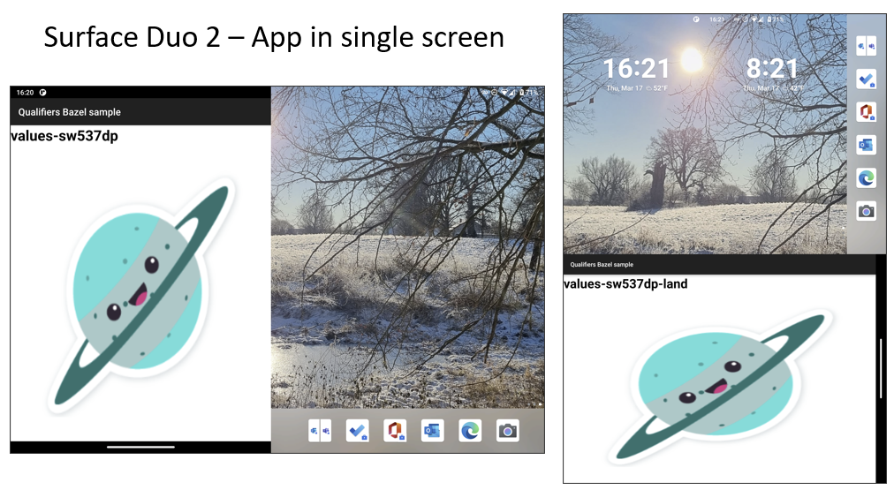
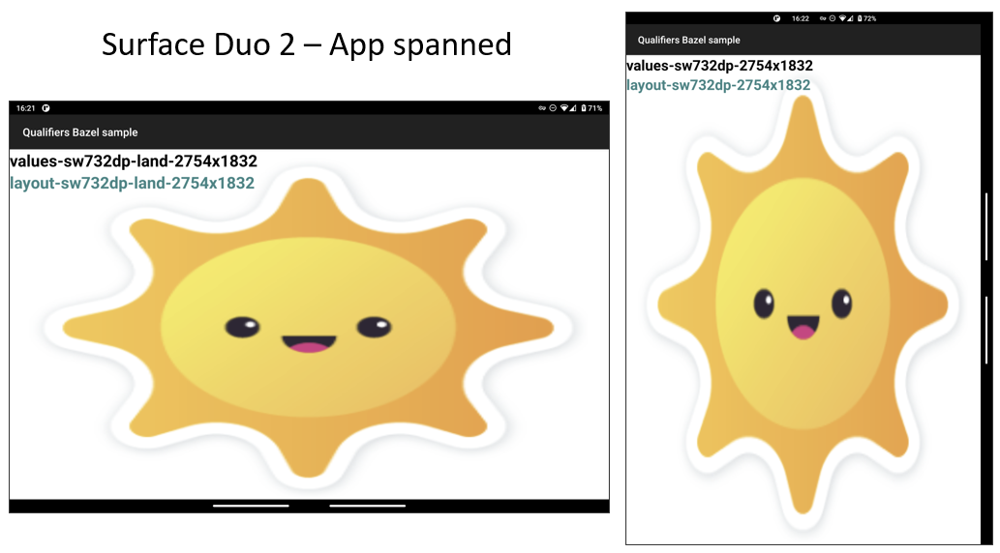

# Resource qualifiers for Surface Duo

This sample contains code that [accompanies this blog post](https://devblogs.microsoft.com/surface-duo/resource-configuration-for-microsoft-surface-duo/), and demonstrates which resource qualifiers work correctly for Surface Duo devices.
Complete docs can be found [here](https://docs.microsoft.com/dual-screen/android/platform/resource-qualifier)

The sample app will show different `resources` depending on the Surface Duo device/emulator version you are using and how the app is displayed (single-screen mode or dual-screen).

The `res` folder contains different resources that devices will use appropriately. 
Specifically for Surface Duo devices we have:

## Surface Duo 1
Single screen mode:
- values-sw540dp
- values-sw540dp-land

Dual screen mode:
- values-sw696dp-2784x1740
- values-sw696dp-land-2784x1740
- layout-sw696dp-2784x1740
- layout-sw696dp-land-2784x1740

## Surface Duo 2
Single screen mode:
- values-sw537dp
- values-sw537dp-land

Dual screen mode:
- values-sw732dp-2754x1832
- values-sw732dp-land-2754x1832 
- layout-sw732dp-2754x1832
- layout-sw732dp-land-2754x1832

The "qualified" directories provide resources when the criteria are matched. 
- `sw` stands for "smallest width". Followed by the specific `dp` value (e.g; 540dp, etc.)
- `land` stands for "landscape".
- `width` x `height` device's display dimensions. (e.g; 2874 x 1740)

## Related links

- [Surface Duo resource qualifier docs](https://docs.microsoft.com/dual-screen/android/platform/resource-qualifier/)
- [Resource configuration blog post](https://devblogs.microsoft.com/surface-duo/resource-configuration-for-microsoft-surface-duo/)
- [Get the Surface Duo emulator](https://docs.microsoft.com/dual-screen/android/emulator/)
